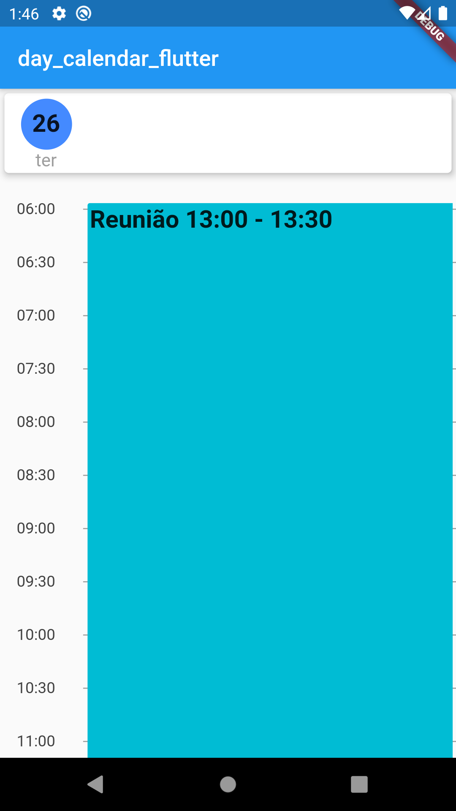

# Day Calendar

[](https://pub.dartlang.org/packages/day_calendar_flutter)

|  |  |
| :------------: | :------------: |
 **Day calendar** with custom styles
 **Day calendar** with all day feature

## Usage

Make sure to check out [example project](https://github.com/RodolfoBonis/DayCalendar/tree/master/example).

### Installation

**Attention use of package flutter_localizations is required**

Add to pubspec.yaml:

```yaml
dependencies:
  day_calendar_flutter: ^1.1.0

flutter_localizations:
  sdk: flutter
```

**Implements the code below in your MaterialApp**
```dart
  @override
  Widget build(BuildContext context) {
    return MaterialApp(
      localizationsDelegates: [
        GlobalMaterialLocalizations.delegate,
        GlobalWidgetsLocalizations.delegate,
      ],
      supportedLocales: [const Locale('pt', 'BR')],
      locale: Locale('pt', 'BR'),
    );
  }
```

**Import the package in your projetct**

```dart
import 'package:day_calendar_flutter/day_calendar_flutter.dart';
```

**Use the package in your project**

```dart
@override
  Widget build(BuildContext context) {
    return Scaffold(
      body: Column(
        children: <Widget>[
          DayCalendarFlutter(
            currentDate: DateTime.now(),
            initialHour: 06,
            finalHour: 22,
            events: [
              new Event(
                color: Colors.cyan,
                initialDate: DateTime(2020, 05, 26, 13, 00),
                finalDate:  DateTime(2020, 05, 26, 13, 30),
                title: "Reunião",
                eventTitleStyle: TextStyle(
                  fontSize: 22,
                  fontWeight: FontWeight.bold,
                ),
                showHours: true,
                allDay: true,
                onEventTap: (event) {
                  print(event)
                }
              ),
            ],
            onTap: (date) {
              print(DateFormat('HH:mm').format(date));
            },
          ),
        ]
      )
    );
  }
```
